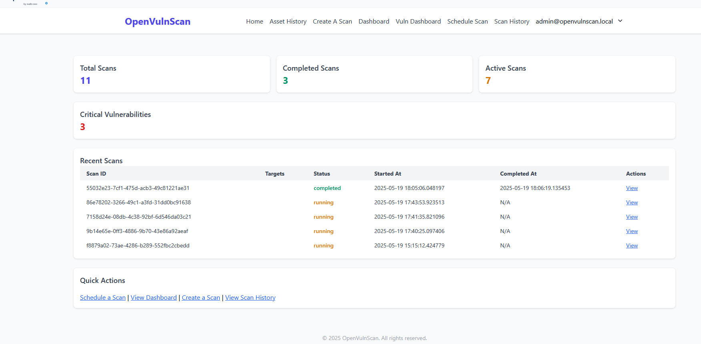
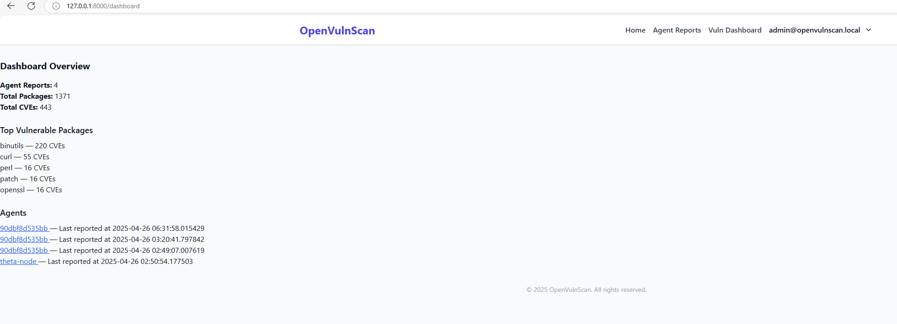
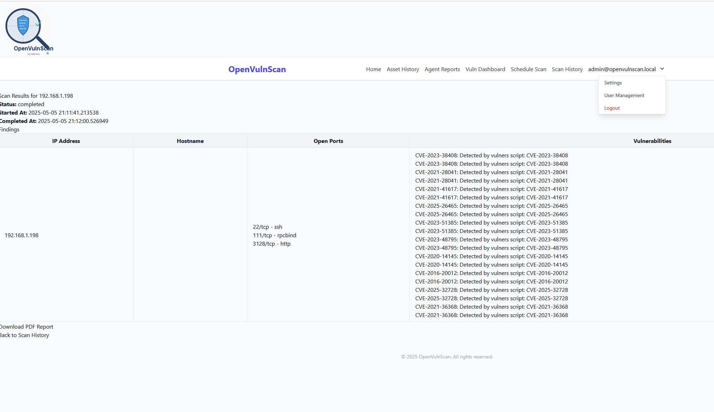
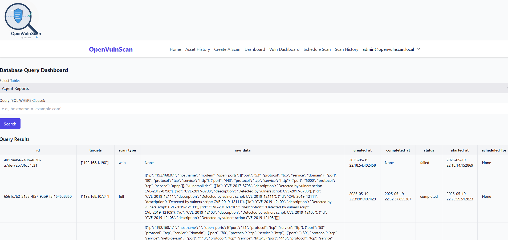
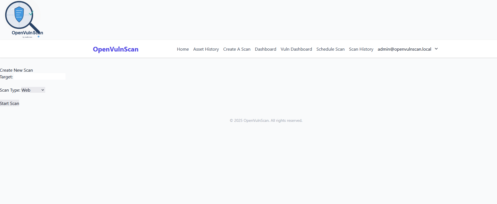
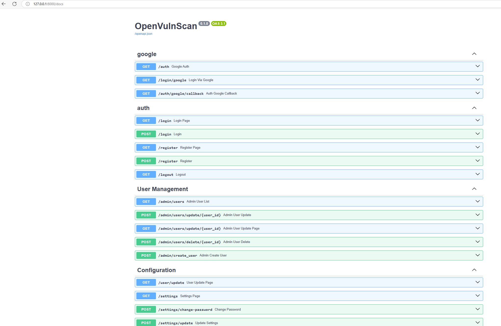

# OpenVulnScan

A simple vulnerability scanning application built with FastAPI.

## Setup

1. Install dependencies:
   ```bash
   pip install -r requirements.txt
   ```

2. Run the application:
   ```bash
   uvicorn app:app --reload
   ```
   OR
   if running via docker:
   Windows:
   ```bash
   docker compose -f docker-compose.winmac.yml up --build
   ```

   Linux:
   ```cmd
   docker compose -f docker-compose.linux.yml up --build
   ```

3. Access the web interface:
   [http://localhost:8000](http://localhost:8000)
   
   
   
   ### New Features
   1) New Dashboard searching
   
   2) New Scan Types[discovery, full, web]
   
   
### API Docs

## Features

- Run vulnerability scans against specified targets
- View scan history and individual scan results
- Download PDF reports of scan findings
- User management
- Deployable agent to report installed packages to central OpenVulnScan server
- Dashboard searching(posibbly report creation)
- Scan Types

---

## Web Interface Links

| Feature | URL |
|--------|-----|
| 🏠 Dashboard | [http://localhost:8000](http://localhost:8000) |
| 📋 View Scan Results | `/scan/{scan_id}` |
| 🧾 Download PDF Report | `/scan/{scan_id}/pdf` |
| 📥 Download Agent Script | `/agent/download?openvulnscan_api=http://<server>:8000/agent/report` |
| 🗂 Agent Reports View | [http://localhost:8000/agent/reports](http://localhost:8000/agent/reports) |
| Blog information | [https://sudo-sec.xyz/blog/tag/openvulnscan]

---

## API Usage (with `curl`)

### 🧪 Start a Scan

```bash
curl -X POST http://localhost:8000/scan \
-H "Content-Type: application/json" \
-d '{"targets": ["127.0.0.1", "example.com"]}'
```

### 📥 Download Agent Script

```bash
curl -O "http://localhost:8000/agent/download?openvulnscan_api=http://localhost:8000/agent/report"
```
openvulnscan_api=`change to the ip address of scanner if not localhost`

```bash
mv download agent.py
python3 agent.py
```

### 📤 Submit Agent Package Report

```bash
curl -X POST http://localhost:8000/agent/report \
-H "Content-Type: application/json" \
-d '{
  "hostname": "my-host",
  "os": "Ubuntu 22.04",
  "packages": [
    {"name": "openssl", "version": "1.1.1"},
    {"name": "curl", "version": "7.68.0"}
  ]
}'
```

---
 
## Project Structure

- `app.py`: Main application entry point
- `config.py`: Configuration settings
- `database/`: Database operations
- `models/`: Pydantic models
- `scanners/`: Scanner implementations
- `services/`: Business logic services
- `utils/`: Utility functions
- `templates/`: HTML templates
- `static/`: Static files
- `data/`: Data storage

---

## License

MIT

